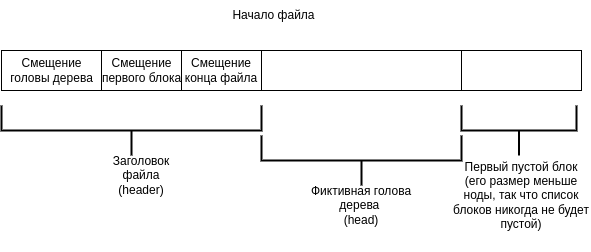
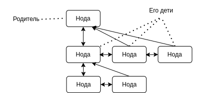
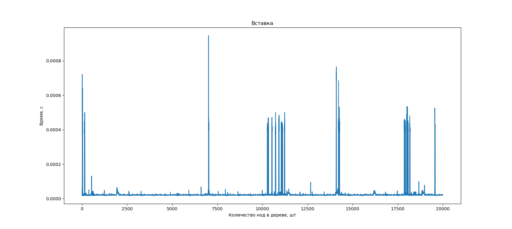
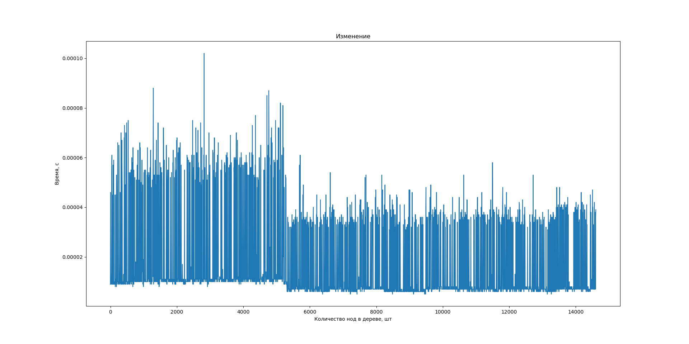
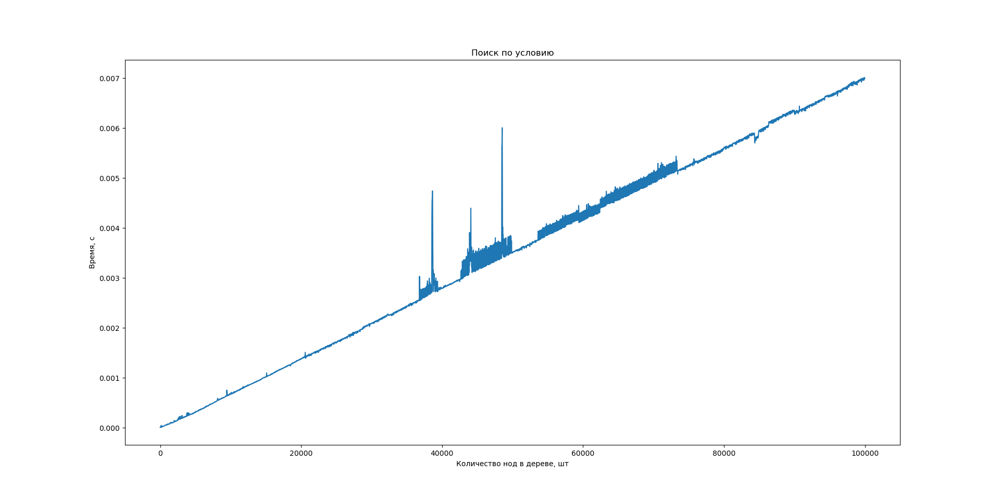
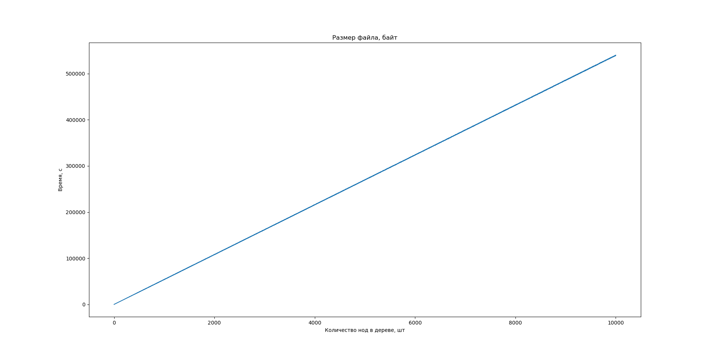

# LLP Lab 1

## Цель

Модуль осуществляющий хранение (выборку, размещение, гранулярное обновление) данных в одном файле в форме документного дерева.

## Задачи

1. Спроектировать структуры данных для представления информации в оперативной памяти
2. Спроектировать представление данных с учетом схемы для файла данных и реализовать базовые
операции для работы с ним
3. Используя в сигнатурах только структуры данных из п.1, реализовать публичный интерфейс со
следующими операциями над файлом данных
4. Реализовать тестовую программу для демонстрации работоспособности решения
5. Результаты тестирования по п.4 представить в составе отчёта, при этом

## Описание работы

Я спроектировала модуль реализующий хранение (выборку, размещение, гранулярное обновление) данных в одном файле в форме документного дерева.

Для начала нужно работы с модулем нужно склонировать репозиторий командой
```
git clone https://github.com/senina-m/llp-db.git
```


Для этого у меня реализованы 4 пакета:

```c
/api //обёртка для пользователя
/db //основные функции и структуры
/io //работа непосредственно с файлом
/test //тесты
```

В пакете [/io](https://github.com/senina-m/llp-db/tree/main/src/io) реализована работа непосредственно с файлом, сохранение и чтение из файла основных структур.
 
В пакете [/db](https://github.com/senina-m/llp-db/tree/main/src/db) хранятся основные структуры с которыми я работаю, там же реализована логика сохранения, изменения и удаляения нод в файле, а так же открытие и закрытие этого файла.

В пакете [/api](https://github.com/senina-m/llp-db/tree/main/src/api) функции из пакета [/db](https://github.com/senina-m/llp-db/tree/main/src/db) обёрнуты для более простого использования и реализован итератор для поиска ноды по значению.

В пакете [/db](https://github.com/senina-m/llp-db/tree/main/src/test) реализованы функции для тестирования всего вышеперечисленного. Там есть два подкаталога: [/db](https://github.com/senina-m/llp-db/tree/main/src/test/hand_tests) и [/db](https://github.com/senina-m/llp-db/tree/main/src/test/generated_tests) для тестирования самих функций и их производительности соответственно. 

## Использование 
Сборка проекта делается командой: ```make```

Далее, если вы объявите в своём ```main.cc``` файле заголовок ```#include api/commands.h``` вам будут доступны функции модуля.

## Доступные функции

Чтобы начать работать с файлом нужно вызвать функцию

```open("filename");```

Когда вы хотите завершить работу необходимо вызвать функцию


```close();```

Основное назначение модуля хранить ноды. Здесь они реализованы так: 

```c
    typedef struct Node{
        size_t offset; //смешение от начала файла
        size_t node_len; // длина в файле в байтах
        size_t first_child; //смещение первого ребёнка
        size_t parent; //смещение родителя
        size_t prev_sibling; //смещение  предыдущего брата
        size_t next_sibling; //смещение следующего брата

        size_t value_len; //длина значения ноды в файле
        int8_t value_t; //тип значения 
        Value_c value_c; //само значение
    } Node;
```


```c
    // тип значения, бывает 4х видов
    enum  Value_t {int_type=0, double_type, string_type, bool_type}; 

//само значение тоже бывает 4х видов
union contents{
    int int_value;
    double double_value;
    const char* string_value;
    bool bool_value;
};

typedef union contents Value_c;

//и есть структура объединяющая тип и значение
typedef struct{
    Value_c c;
    Value_t t;
} Value;
```

**Поиск по дереву** можно сделать двумя способами, либо получить голову всего дерева комадой:

```Node* read_first();```

Либо вызвать функцию, которая будет искать вам ноды по определённому значению:

```Iter it = find_nodes(Condition condition);```

Она возвращает итератор, и если сделать от итератора вызов ```it.next()``` он найдёт следующее подходящее значение. Чтобы это значение получить нужно разыменовать итератор ```*it```. Так вы получите ```Node*```.

```Condition``` необходимый этому методу выглядит вот так:

```c
//способ сравненя нод
enum Compare{
    EQUAL, // ноды равны
    NOT_EQUAL, // ноды не равны
    NO_CONDITION  //подходит любая нода
};

typedef struct Condition{
    Value value; //значение, с которым сравниваем
    Compare comp; //способ стравнения 
    
    //конструктор
    Condition(Value new_value, Compare new_comp)
}Condition;
```

Если вы нашли какую-то ноду её можно изменить, удалить или добавить к ней ребёнка.

Для **добавляния** новой ноды в дерево нужно вызвать 

```Node* add_node(Value v, Node* parent);```

В эту функцию нужно передать стурктуру ```Value``` и ```Node```.
Соответственно, ```Value``` вы составляете по своему желанию, а вот родителя, к которому захочется добавлять ноды нужно предварительно получить его. 

Для **изменения** ноды нужно так же подготовить новое значение ```Value``` и передать его вместе с объектом ноды которую вы хотите изменить в функцию:

```void edit_node(Value v, Node* node);```

Если вы хотите **удалить** ноду, воспользуйтесь функцией:

```void delete_node(Node* parent);```

Чтобы напечатать содержимое ноды на экран вызовите функцию:

```void print(Node* node);```

Так же как и другие аллоцированные структуры Node* нужно чистить после использования, для этого есть команда:

```void f_node(Node* node);```

Например, так:
```c
    open("test"); //начинаем работу с файлом
    Node* node = read_first(); //находим голову дерева
    
    //подготваливаем значение, чтобы добавить новую ноду
    const char *str = (char*) malloc(sizeof(char)*5);
    snprintf((char *)str, 5, "hell");
    Value_c c1 = {.string_value = str};
    Value v1 = {.c = c1, .t = string_type};

    Node* added = add_node_db(node, &v1); //добавляем ноду

    print(added); //печатаем её в консоль

    //подготваливаем значение, чтобы изменить ноду
    Value_c c2 = {.bool_value = true};
    Value v2 = {.c = c2, .t = bool_type};

    edit_node(v2, added); //изменяем ноду

    print(added); //печатаем её в консоль

    delete_node(added); //удаляем ноду

    f_node(added);//чистим память структур
    f_node(node);

    close(); //завершаем работу с файлом
```

## Модель хранения данных в файле

Данные сохраняются в файл последовательно так же как хранятся в структурах. Ссылки друг на друга хранят как смещение относительно начала файла в байтах.

Кроме этого есть ещё структуры ```Block``` они занимают пустые места, с которых ноды удалили, но куда потом их можно вставить. Они хранятся двуствязным списком. Содержат такие поля:

```c
typedef struct Block{
    size_t next; // сделующий блок
    size_t prev; // предыдущий блок
    size_t size; // размер занимаемой им дырки
} Block;
```

В начале файла хранится служебная информация о началах списков. 


Сами ноды в дереве хранят следующие ссылки:


А дерево нод соответственно выглядит вот так:



Т.е. мы храним дерево нод, где все дети одного родителя объединены в двусвязный спискок. При этом каждая нода знает, где её первый ребёнок (голова двусвязного списка детей) и родитель.

Так же в файле в освободившихся от нод дырках хранятся структуры блоков, чтобы знать об этих дырках. Это тоже двусвязный список.

### Вставка
Тогда для вставки нам достаточно просто найти блок, куда наша структура поместится. После этого мы просто удаляем этот блок, а поскольку блоки хранятся двусвязным списком -- это довольно легко -- мы просто соединяем соседей друг с другом. 
Дальше для той вершины, которую мы вставляем нужно проинформировать её родителя, что у него есть дети, если их раньше не было. А если были -- мы просто заполняем структуру новой ноды и дописываем её в конец двусвязного списка детей -- тоже дешёвая операция. 

### Изменение
Если же мы хотим изменить ноду, может оказаться, что она больше чем была или меньше. 
    * Если оказалась меньше мы просто перезаписываем значение, потому что в ноде есть поле указывающее его длину и теперь оно больше, чем фактически занимает нода, но занять это свободное место не может. Я решила что так будет лучше, потому что, если освобождать такое "лишнее" место может сильно ухудшиться ситуация с фрагментацией файла. У нас появится много малюсеньких дырочек за всеми,из которых надо будет следить. А ведь они могут оказаться даже меньше, чем размер полей самой дырки. 
    * Если места оказалось больше -- просто как и при вставке ищем новое место для нашей ноды. Но теперь о переезде надо незабыть уведомить детей этой ноды, её братьев и родителей.

### Удаление
Если нам нужно удалить ноду, то удалятся и все её дети. Тогда нам нужно будет пробежаться по всем детям и превратить их в дырки. Я это делала рекурсивно, чтобы не хранить свой стек, чтобы всё автоматически сохранялось. А для ноды -- мы просто удаляем её из списка братьев, а если она была первой, то и родителя уведомляем, что теперь у него другой ребёнок.  

```c
void delete_children(size_t node){
    size_t first_child = read_first_child_offset(node, ptr);
    if(first_child != 0){ //если есть ребёнок
        delete_children(first_child);
    }

    size_t next_sibling = read_next_sibling_offset(node, ptr);
    if(next_sibling != 0){ //если есть братья
        delete_children(next_sibling);
    }
    //чистим эту ноду -- записываем вместо ноды пустой блок
    create_block(&(header->free_space_offset), node, read_node_len(node, ptr), ptr);
}
```
### Поиск
Поиск я реализовала, как итератор, чтобы не считать лишнее, если пользователю нужна одна нода. А не все. Соответственно тут мы рассматриваем сначала детей, братьев и их детей на соответствие критерию, а когда весь низ графа под предыдущим значением итератора покрыт -- ищем сверху, в родителях их братьях и детях. Если не нашли и уверены, что больше не найдём возвращаем ```false```.


## Тесты

Тесты были запущены на машине:

Parrot OS версия ядра 5.16.0-12, CPU: Intel Core i7-11800H, 16Gb RAM

### Результаты
Добавление в дерево новой ноды

Видно, что время вставки не зависит от того, сколько нод уже есть в дереве, потому что мы работаем только с одним родителем и его детьми. 

Изменение ноды

Видно, что время изменение не зависит от того, сколько нод уже есть в дереве, потому что мы работаем только с одним родителем и его детьми. Но занимает больше вставки, потому что мы должны всех уведомить, что переехали. Плюс в реализации алгоритма возможно есть где-то ошибка.

Удаление ноды

Видно, что время удаление не зависит от того, сколько нод уже есть в дереве, потому что мы работаем только с одним родителем и его детьми. Это быстрее, чем ихзменение, возможно потому, что для детей мы ничего не проверяем, делаем их просто дырками и всё.

Поиск

Поиск должен линейно зависить от размера дерева, потому что чем больше дерево, тем дольше мы будем его полностью обходить.

Размер файла от размера дерева

Размер файла тоже должен линейно зависить от размера дерева, потому что каждую ноду мы сохраняем в файл, а места они занимают в среднем одинаково. 

## Выводы
В этой лабораторной я в очередной раз заново научилась олавливать и отлаживать утечки памяти. Три раза её переписала, потому что страктура данных была изначально спроектированная неправильно. Плюс ещё разз освежила в памяти как программировать на си, потому что функции си++ я почти не использовала. Ну и чуть лучше разобралась в том, как реализуются документные базы данных и файловые системы. Мой модуль далёк от идела, но общие принципы даёт понять. 