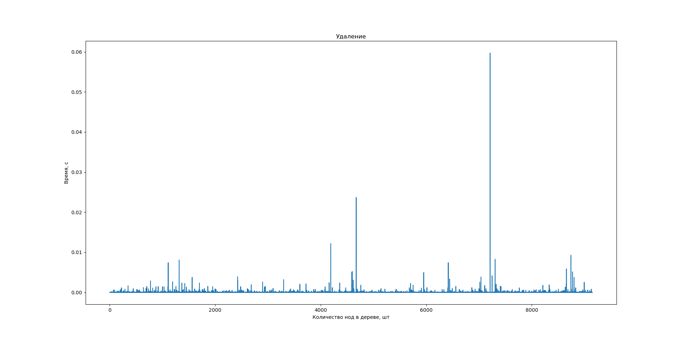

# LLP Lab 1

Модуль осуществляющий хранение (выборку, размещение, гранулярное обновление) данных в одном файле в форме документного дерева.

## Работа с модулем

Для начала нужно склонировать репозиторий командой
```
git clone https://github.com/senina-m/llp-db.git
```

Сборка проекта делается командой:

Далее, если вы объявите в своём ```main.cc``` файле заголовок ```#include api/commands.h``` вам будут доступны функции модуля.

## Доступные функции

Чтобы начать работать с файлом нужно вызвать функцию

```open("filename");```

Когда вы хотите завершить работу необходимо вызвать функцию


```close();```

Основное назначение модуля хранить ноды. Здесь они реализованы так: 

```c
    typedef struct Node{
        size_t offset; //смешение от начала файла
        size_t node_len; // длина в файле в байтах
        size_t first_child; //смещение первого ребёнка
        size_t parent; //смещение родителя
        size_t prev_sibling; //смещение  предыдущего брата
        size_t next_sibling; //смещение следующего брата

        size_t value_len; //длина значения ноды в файле
        int8_t value_t; //тип значения 
        Value_c value_c; //само значение
    } Node;
```


```c
    // тип значения, бывает 4х видов
    enum  Value_t {int_type=0, double_type, string_type, bool_type}; 

//само значение тоже бывает 4х видов
union contents{
    int int_value;
    double double_value;
    const char* string_value;
    bool bool_value;
};

typedef union contents Value_c;

//и есть структура объединяющая тип и значение
typedef struct{
    Value_c c;
    Value_t t;
} Value;
```

**Поиск по дереву** можно сделать двумя способами, либо получить голову всего дерева комадой:

```Node* read_first();```

Либо вызвать функцию, которая будет искать вам ноды по определённому значению:

```Iter it = find_nodes(Condition condition);```

Она возвращает итератор, и если сделать от итератора вызов ```it.next()``` он найдёт следующее подходящее значение. Чтобы это значение получить нужно разыменовать итератор ```*it```. Так вы получите ```Node*```.

```Condition``` необходимый этому методу выглядит вот так:

```c
//способ сравненя нод
enum Compare{
    EQUAL, // ноды равны
    NOT_EQUAL, // ноды не равны
    NO_CONDITION  //подходит любая нода
};

typedef struct Condition{
    Value value; //значение, с которым сравниваем
    Compare comp; //способ стравнения 
    
    //конструктор
    Condition(Value new_value, Compare new_comp)
}Condition;
```

Если вы нашли какую-то ноду её можно изменить, удалить или добавить к ней ребёнка.

Для **добавляния** новой ноды в дерево нужно вызвать 

```Node* add_node(Value v, Node* parent);```

В эту функцию нужно передать стурктуру ```Value``` и ```Node```.
Соответственно, ```Value``` вы составляете по своему желанию, а вот родителя, к которому захочется добавлять ноды нужно предварительно получить его. 

Для **изменения** ноды нужно так же подготовить новое значение ```Value``` и передать его вместе с объектом ноды которую вы хотите изменить в функцию:

```void edit_node(Value v, Node* node);```

Если вы хотите **удалить** ноду, воспользуйтесь функцией:

```void delete_node(Node* parent);```

Чтобы напечатать содержимое ноды на экран вызовите функцию:

```void print(Node* node);```

Так же как и другие аллоцированные структуры Node* нужно чистить после использования, для этого есть команда:

```void f_node(Node* node);```

Например, так:
```c
    open("test"); //начинаем работу с файлом
    Node* node = read_first(); //находим голову дерева
    
    //подготваливаем значение, чтобы добавить новую ноду
    const char *str = (char*) malloc(sizeof(char)*5);
    snprintf((char *)str, 5, "hell");
    Value_c c1 = {.string_value = str};
    Value v1 = {.c = c1, .t = string_type};

    Node* added = add_node_db(node, &v1); //добавляем ноду

    print(added); //печатаем её в консоль

    //подготваливаем значение, чтобы изменить ноду
    Value_c c2 = {.bool_value = true};
    Value v2 = {.c = c2, .t = bool_type};

    edit_node(v2, added); //изменяем ноду

    print(added); //печатаем её в консоль

    delete_node(added); //удаляем ноду

    f_node(added);//чистим память структур
    f_node(node);

    close(); //завершаем работу с файлом
```

## Модель хранения данных в файле

Данные сохраняются в файл последовательно так же как хранятся в структурах. Ссылки друг на друга хранят как смещение относительно начала файла в байтах.

Кроме этого есть ещё структуры ```Block``` они занимают пустые места, с которых ноды удалили, но куда потом их можно вставить. Они хранятся двуствязным списком. Содержат такие поля:

```c
typedef struct Block{
    size_t next; // сделующий блок
    size_t prev; // предыдущий блок
    size_t size; // размер занимаемой им дырки
} Block;
```

В начале файла хранится служебная информация о началах списков. 


Сами ноды в дереве хранят следующие ссылки:


А дерево нод соответственно выглядит вот так:


## Модули программы

```c
/api //обёртка для пользователя
/db //основные функции и структуры
/io //работа непосредственно с файлом
/test //тесты
```

## Тесты

Тесты были запущены на машине:

Parrot OS версия ядра 5.16.0-12, CPU: Intel Core i7-11800H, 16Gb RAM

### Результаты
Добавление в дерево новой ноды


Изменение ноды


Удаление ноды


Поиск


Размер файла от размера дерева
